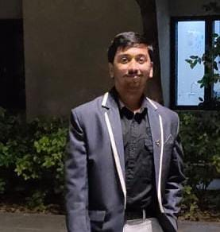

# Welcome to My Portfolio

👋 Hello! I'm Abhishek Tagalpallewar, a Mechanical Engineering student at the Indian Institute of Technology Gandhinagar.

During my first year, I’ve explored the fundamentals of several disciplines beyond mechanical engineering, from coding to world civilizations.

This portfolio highlights my journey of learning, building, and growing through projects, technical exploration, and teamwork. 

---

🔍 In this portfolio, you’ll find:

- 🛠️ **Projects** I’ve worked on

- 💻 **Skills** in programming, tools, and technical knowledge

- 🏆 **Experiences** in college events and collaborations

- 📚 **Hobbies** that keep me inspired

- 📬 **Contact** to get in touch

---

🎯 **Current Focus**: Exploring the intersection of mechanical engineering and software development.

